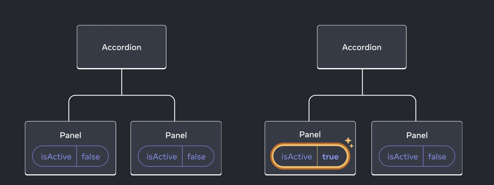
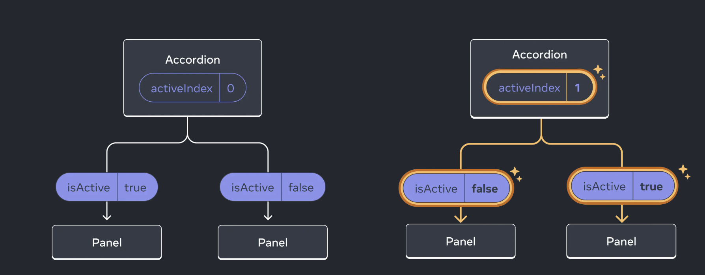
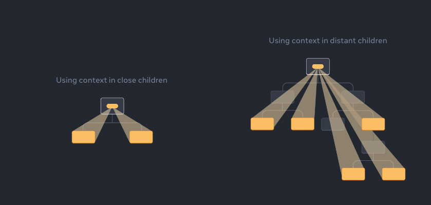

# React Concepts: Prop Drilling vs Context API

## Prop Drilling

Prop drilling is a technique in React where props are passed from one part of the tree to another by going through other parts that do not need the data, but help pass it around.

Pros:

1. **Simple to understand:** Great for small applications where state can be easily managed.
2. **Component Isolation:** The component more reusable and testable because it doesn't rely on context or global state, all you need to do is pass information.
3. **Predictable Data Flow**: With prop drilling, it's clear where the data comes from and how it's passed down. This leads to more predictable and easier to understand code.

Cons:

1. **Code complexity:** As application grows large, passing props down multiple levels becomes complex.
2. **Maintenance:** Any small change in the structure might require significant code modifications.

Example: Consider the initial code, where theme prop is passed from App to Header, then Navbar, and then UserIcon.

### Syncing State with Prop Drilling

When components need to share and synchronize state, one approach is lifting the state up to a common ancestor component.

This setState action within the ancestor component will change the state, causing a re-render and passing the new state down to the child components via props. If the state is well-managed and this pattern is used effectively, this can lead to well-synchronized stateful logic in your React app.

## Context API

It provides a way to share values between components without having to explicitly pass a prop through every level of the tree. Context is designed to share data that can be considered "global".

Pros:

1. **Avoid prop drilling:** No need to pass props through intermediate levels.
2. **Ease of use:** Easier to manage state in larger applications.

Cons:

1. **Less optimized:** Re-renders might be more frequent as a context value can change components high up in the tree.

Example: The latter code uses ThemeContext to provide and consume the theme state. App, Header, Navbar, and UserIcon all just use useTheme() to access it.

### Standard Use Cases for Context

- **Theming:** Manage themes, like dark or light mode, using a context provider at the app's top level for global changes.
- **Current Account:** Store active user data in context for easy access across components for login statuses or multi-user interactions.
- **Routing:** Utilize context to manage the current route, allowing link components to easily determine their active state.
- **State Management:** In larger apps with complex state requirements, pair a reducer with context for efficient state management and propagation across the component tree.

## Comparison Recap

When comparing, prop drilling is perfectly fine for small components and applications where the levels aren't deeply nested. However, in a large application, this prop drilling becomes a pain point, which can be solved using Context API.

Prop drilling can lead to component complexity and can make code harder to maintain. Context API solves this problem by making data accessible at multiple levels without passing it through props.

However, avoid overuse of the Context API. Every Context consumer re-renders when the context value changes, which can lead to unnecessary rendering if components consume a context but don't need to use the data that changed.
